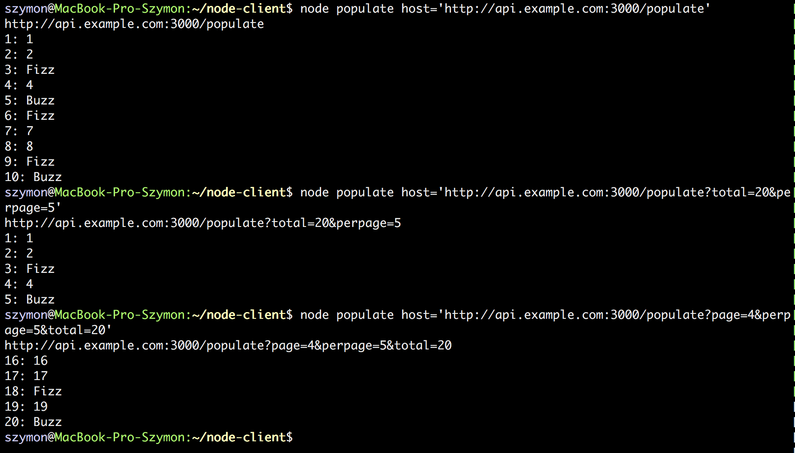

# Challenging old, good FizzBuzz
[](https://codeclimate.com/github/szymon33/fizzbuzz)
[](https://codeclimate.com/github/szymon33/fizzbuzz/coverage)

This is just yet another example FizzBuzz program **but** as a Rails web application together with JSON API and console client to consume the FizzBuzz application API. Very basic functionality.


## Detailed description

**Task A: Ruby on Rails FizzBuzz application**

* Standard FizzBuzz rules, divisible by 3 is Fizz, divisible by 5 is Buzz
* Should display values from 1 to 100 on the homepage
* Should allow viewing values up to 100,000,000,000
* Should have pagination
* Should allow changing of the page size
* User should be able to mark certain numbers as their favourites, these should indicate that they are favourites on the UI and be persisted
* Should provide a JSON API with all the above mentioned functionality

**Task B: Client to consume the JSON API**

* Create a client to consume the FizzBuzz application API
* Should be available from the command line


## Implementation requirements

* Ruby version 2.1 or higher.
* Rails version 4.2.
* No database, no ActiveRecord.
* Webrick web server but you can comment it out in the [gemfile](Gemfile) and use what is up to your preferences.
* No authentication (not required).


## Installation

Just basic stuff here after cloning the repo.

1. Run
  ```
  bundle
  ```
1. Start web server
  ```
  bundle exec rails s
  ```
1. JSON API is in subdomain so add something like
  ```ruby
    127.0.0.1       api.example.com 
  ```

to your `/etc/hosts` file when testing.


## Checking Rails web application

There are just two pages:

1. "FizzBuzz Hundred Home Page" - app home page which populates first 100 FizzBuzz numbers and that's it.

2. "FizzBuzz Populate with Pagination Page" - page populates FizzBuzz numbers in terms of parameters and paginate the results. You have the following parameters for your disposal:

  **total** - maximum FizzBuzz number. Default is set to 100.

  **perpage** - size of the page. Default is set to 10.

  **page** - current page number. Default is 1.

You can setup parameters like this:

```console
  http://localhost:3000/populate?total=300&perpage=20&page=2
```

Above will produce 300 FizzBuzz numbers and display 20 of them from 21 to 40 (page 2).

Watch video to see how it is actually working:

[](http://www.youtube.com/watch?v=YgZH3bGb608)


## Checking JSON API with cURL

You might check application status like this

  ```console
  curl http://api.example.com:3000
  ```

with the following result

  ```json
  {"message":"OK"}
  ```

You might inspect how I play with [cURL](https://en.wikipedia.org/wiki/CURL) in the following [sample sessions file](CURL.md).


## Automatic testing

I use [Rspec](http://rspec.info/) for tests. Both JSON API and web application were developed facing [TDD](https://en.wikipedia.org/wiki/Test-driven_development) approach. You could see Code Climate status as a badge on very top of this file proves 100% coverage.


## Client to consume the FizzBuzz application API

It is a javascript with Node.js implementation. After you install ```npm``` and ```node.js``` you have to install [Request - Simplified HTTP client](https://github.com/request/request):

  ```console
  npm install request
  ```

I wrote [populate.js](node-client/populate.js) programs.

You could populate first 100 FizzBuzzes like the following

  ```console
  node node-client/populate host='http://api.example.com:3000'
  ```

Below is one of my console sessions:



[May, 2016]
